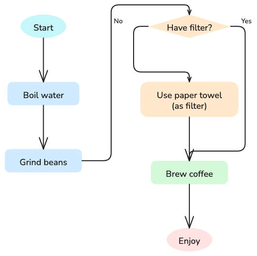
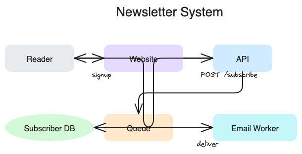
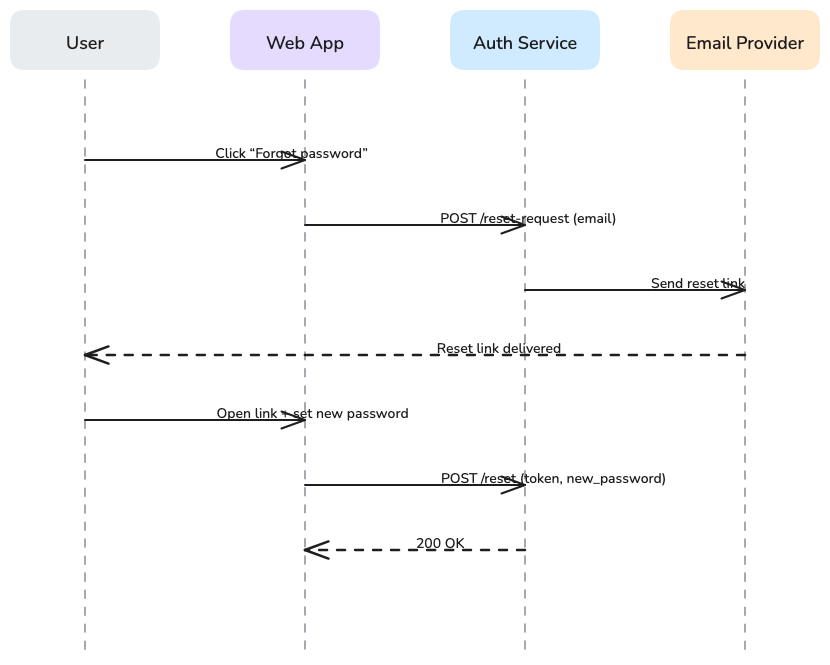
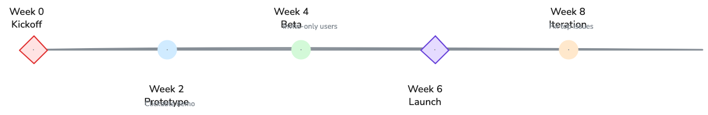
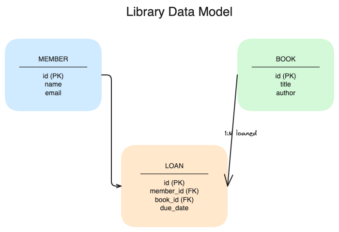
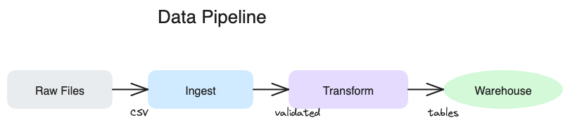

# OpenClaw Excalidraw Skill

Generate clean **Excalidraw** diagrams from text using a small Python diagram DSL + PNG export.

This skill is designed for OpenClaw users who want **fast visual thinking**:
- turn messy text into a diagram you can edit
- ship a PNG preview to chat
- keep the editable `.excalidraw` source for later

## What you get

- **PNG export** (for quick sharing)
- **`.excalidraw` source** (editable in Excalidraw/Obsidian)
- **Auto-selection** of diagram type (via `diagram_router.py`) *or* you can force a type

## Output + Storage

By default, the skill can copy outputs into an Obsidian vault diagrams folder.
Configure it via env var:
- `OBSIDIAN_DIAGRAMS_DIR=~/Documents/Obsidian/diagrams`

If unset, Obsidian copying is disabled (you still get PNG + .excalidraw wherever you output them).

You can also just write to `/tmp` or any output directory.

## Quickstart (OpenClaw)

### 1) Use the skill

In OpenClaw, ask something like:
- "diagram this login flow"
- "make a sequence diagram for the checkout API"
- "turn this spec into an architecture diagram"

The intended flow is:
1. detect best diagram type
2. **agent writes a small Python script** using the diagram classes
3. render `.excalidraw`
4. export PNG via Playwright

### 2) View/edit the `.excalidraw`

- Excalidraw web: drag file onto https://excalidraw.com
- Obsidian: install the Excalidraw plugin and open the file
- VS Code: install an Excalidraw extension

## Diagram types (what they’re good for)

Each type below includes a **non-sensitive sample** committed under `examples/`.

### 1) Flowchart
**Best for:** processes, decision trees, user flows, “if/then/else”, SOPs.

Sample topic: **Making coffee**

Implementation:
- `AutoLayoutFlowchart` for most cases (automatic layout)
- `Flowchart` for manual positioning

### 2) Architecture diagram
**Best for:** systems thinking: components/services/datastores + connections.

Sample topic: **Newsletter system**

Implementation:
- `ArchitectureDiagram` or plain `Diagram` for full manual control

### 3) Sequence diagram
**Best for:** message passing over time (request/response), protocols, API flows.

Sample topic: **Password reset**

Implementation:
- `SequenceDiagram`

### 4) Mind map
**Best for:** brainstorming, topic decomposition, categories/subtopics.

Sample topic: **Learning Spanish**

Implementation:
- `MindMap`

### 5) Timeline
**Best for:** history, project roadmap, milestones.

Sample topic: **Product launch plan**

Implementation:
- `TimelineDiagram`

### 6) ER diagram
**Best for:** database schemas, entities/relationships.

Sample topic: **Library system**

Implementation:
- `ERDiagram` *or* `Diagram` (manual layout often looks cleaner)

### 7) Simple diagram (freeform)
**Best for:** everything else.

Sample topic: **Data pipeline**

Implementation:
- `Diagram` base class: boxes + arrows + text

## Local development / scripts

### PNG export
PNG export is done via Playwright (Node) using:
- `scripts/export_playwright.js`

### Export helper
- `scripts/export_and_deliver.py` exports `.excalidraw → .png` and can copy to an Obsidian folder.

## Security notes

This repo intentionally uses subprocess execution for:
- calling `node export_playwright.js`
- installing optional layout dependency in `layout_engine.py`

That will trip any security scanner that flags process spawning.
It’s expected behavior; review before installing on sensitive machines.

## License

TBD (inherits from your OpenClaw workspace usage; add an explicit license if you plan to publish).
